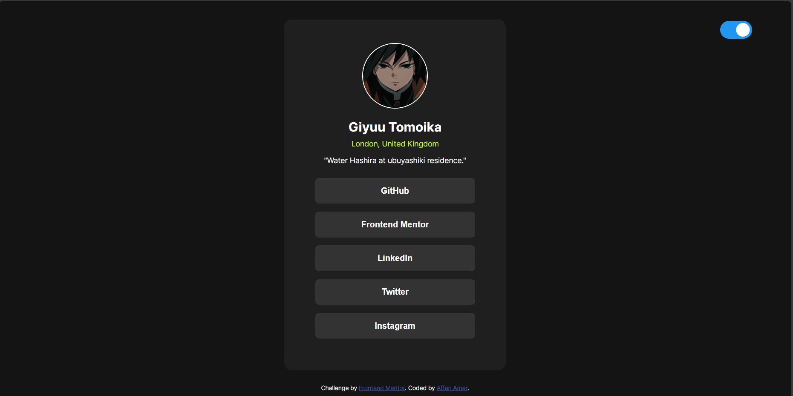

# Frontend Mentor - Social links profile solution

This is a solution to the [Social links profile challenge on Frontend Mentor](https://www.frontendmentor.io/challenges/social-links-profile-UG32l9m6dQ). Frontend Mentor challenges help you improve your coding skills by building realistic projects. 

## Table of contents

- [Overview](#overview)
  - [The challenge](#the-challenge)
  - [Screenshot](#screenshot)
  - [Links](#links)
- [My process](#my-process)
  - [Built with](#built-with)
  - [What I learned](#what-i-learned)
  - [Useful resources](#useful-resources)
- [Author](#author)

**Note: Delete this note and update the table of contents based on what sections you keep.**

## Overview

### The challenge

Users should be able to:

- See hover and focus states for all interactive elements on the page

### Screenshot

### Links

- Solution URL: [Solution](https://github.com/AffanRM/social-links-profile)
- Live Site URL: [Live site](https://affanrm.github.io/social-links-profile/)

## My process

### Built with

- Semantic HTML5 markup
- CSS custom properties
- Flexbox
- Basic Javascript

### What I learned

This project helped me brush up on the basics of HTML and CSS as I worked on a web development project after some time.
To take this project a little further, I decided to add some basic transitions and animations and also a light/dark mode theme using basic javascript.

### Useful resources

- [Css Flexbox](https://www.w3schools.com/csS/css3_flexbox_container.asp) - This helped me get a refresher for css flexbox.
- [Toggle switch css](https://www.w3schools.com/howto/howto_css_switch.asp) - This article was helpful in creating the toggle switch for the theme switch.

## Author

- Website - [Add your name here](https://www.your-site.com)
- Frontend Mentor - [@AffanRM](https://www.frontendmentor.io/profile/AffanRM)

